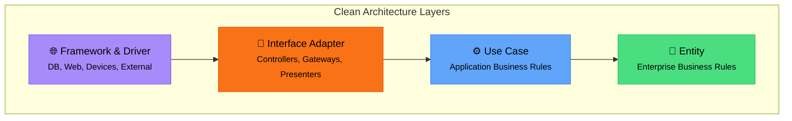
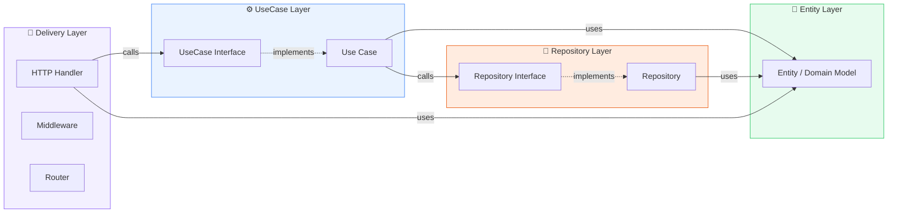
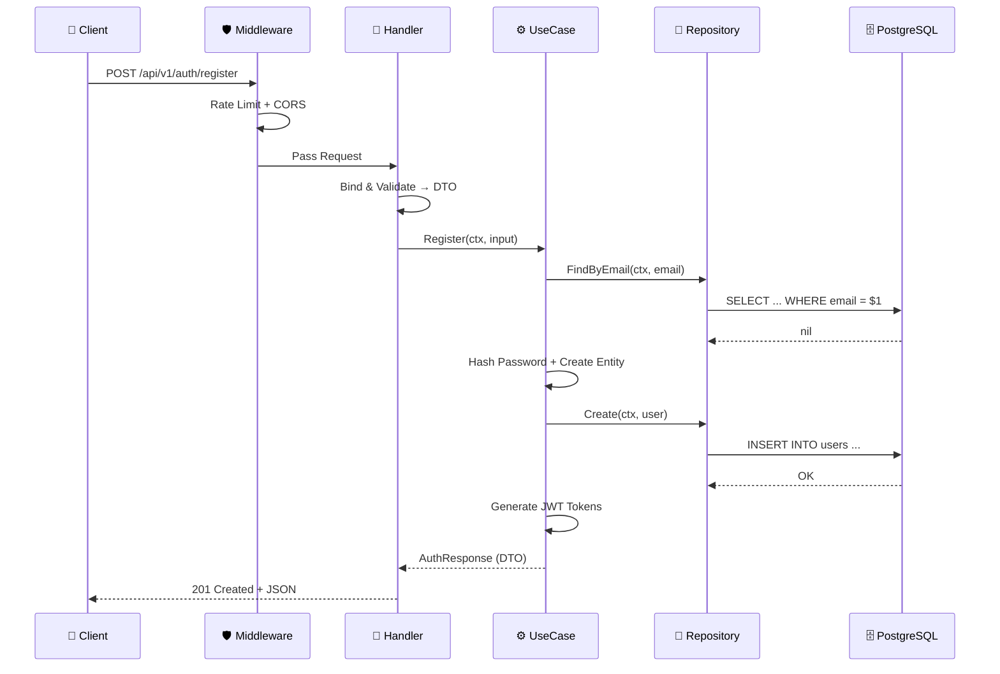
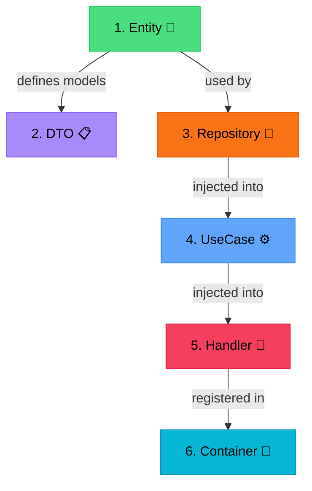
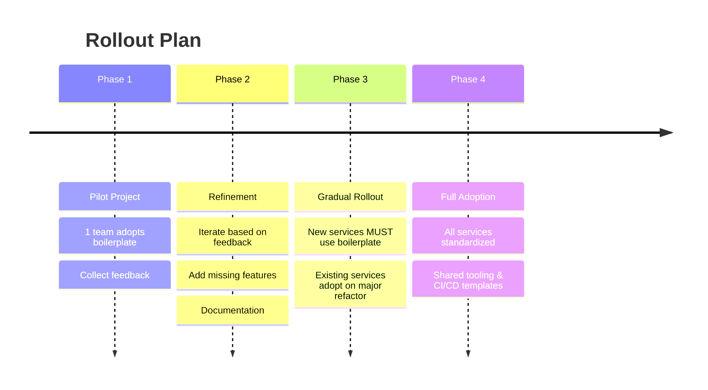

# Standardizing Go Services <br> with Clean Architecture

<div class="pt-6">
  <span class="px-4 py-2 rounded-full bg-white bg-opacity-20 text-sm font-medium backdrop-blur-sm">
    Kelas TJempolan - Tech Talk
  </span>
</div>

<div class="abs-br m-6 flex gap-2 items-center text-sm opacity-70">
  <carbon-logo-gitlab />
  <span>Syntra Backend Boilerplate</span>
</div>

<!--
Selamat datang di sharing session kita hari ini. 
Kita akan membahas bagaimana kita bisa menstandarkan Go services kita menggunakan Clean Architecture.
-->

---
layout: intro
---

# Agenda

<div class="grid grid-cols-2 gap-8 pt-4">

<div>

### Part 1: The Why

- Masalah yang sering terjadi
- Mengapa perlu standarisasi?
- Apa itu Clean Architecture?

</div>

<div>

### Part 2: The How

- Deep dive ke boilerplate
- Struktur direktori & layer
- Live walkthrough
- Bagaimana cara adoptnya

</div>

</div>

<br>

---
layout: section
background: https://awsimages.detik.net.id/community/media/visual/2025/04/29/ilustrasi-transjakarta-1745903314872_169.jpeg?w=1200
---

# Part 1

## The Problem

---
layout: default
---

# 4 Services, 4 Struktur Berbeda

<div class="grid grid-cols-2 gap-3 pt-2">

<div class="p-3 rounded-xl bg-red-500 bg-opacity-10 border border-red-500 border-opacity-30">
<h3 class="!text-sm !mt-0 !mb-1">Service A</h3>
<pre class="!text-[11px] !p-2 !m-0 opacity-80">controllers/
models/
services/
utils/
main.go</pre>
</div>

<div class="p-3 rounded-xl bg-orange-500 bg-opacity-10 border border-orange-500 border-opacity-30">
<h3 class="!text-sm !mt-0 !mb-1">Service B</h3>
<pre class="!text-[11px] !p-2 !m-0 opacity-80">api/
db/
handlers/
types/
main.go</pre>
</div>

<div class="p-3 rounded-xl bg-yellow-500 bg-opacity-10 border border-yellow-500 border-opacity-30">
<h3 class="!text-sm !mt-0 !mb-1">Service C</h3>
<pre class="!text-[11px] !p-2 !m-0 opacity-80">domain/
  user/
    handler.go
    service.go
    repo.go
main.go</pre>
</div>

<div class="p-3 rounded-xl bg-purple-500 bg-opacity-10 border border-purple-500 border-opacity-30">
<h3 class="!text-sm !mt-0 !mb-1">Service D</h3>
<pre class="!text-[11px] !p-2 !m-0 opacity-80">pkg/
internal/
cmd/</pre>
</div>

</div>

<div class="mt-3 px-4 py-2 bg-red-500 bg-opacity-10 rounded-lg border border-red-500 border-opacity-30 text-center text-sm">
  Setiap engineer punya preferensi sendiri. Pindah ke service lain? <strong>Re-learn dari awal.</strong>
</div>

<!--
Setiap engineer punya preferensi sendiri. Ketika masuk ke service orang lain, butuh waktu lama untuk understand codebase-nya.
-->

---
layout: default
---

# Pain Points yang Kita Rasakan

<div class="space-y-3 pt-4">

<div class="flex items-start gap-3 px-4 py-3 rounded-lg bg-red-500 bg-opacity-5 border-l-4 border-red-500">
  <div class="text-2xl">🔄</div>
  <div>
    <h3 class="text-base font-bold text-red-400 !my-0">Bingung Saat Pindah Team</h3>
    <p class="text-xs opacity-80 !my-0">Pindah ke team lain? Harus belajar ulang struktur project karena setiap service beda convention.</p>
  </div>
</div>

<div class="flex items-start gap-3 px-4 py-3 rounded-lg bg-orange-500 bg-opacity-5 border-l-4 border-orange-500">
  <div class="text-2xl">🧪</div>
  <div>
    <h3 class="text-base font-bold text-orange-400 !my-0">Testing Jadi Nightmare</h3>
    <p class="text-xs opacity-80 !my-0">Business logic nyampur di handler, mocking jadi susah, coverage rendah.</p>
  </div>
</div>

<div class="flex items-start gap-3 px-4 py-3 rounded-lg bg-yellow-500 bg-opacity-5 border-l-4 border-yellow-500">
  <div class="text-2xl">🔧</div>
  <div>
    <h3 class="text-base font-bold text-yellow-400 !my-0">Maintenance Mahal</h3>
    <p class="text-xs opacity-80 !my-0">Ganti database? Refactor satu service? Efeknya kemana-mana karena tight coupling.</p>
  </div>
</div>

<div class="flex items-start gap-3 px-4 py-3 rounded-lg bg-blue-500 bg-opacity-5 border-l-4 border-blue-500">
  <div class="text-2xl">📝</div>
  <div>
    <h3 class="text-base font-bold text-blue-400 !my-0">Code Review Tidak Efektif</h3>
    <p class="text-xs opacity-80 !my-0">Reviewer harus paham konteks tiap service dulu sebelum bisa review. Tidak ada convention yang sama.</p>
  </div>
</div>

</div>

---
layout: section
background: https://images.unsplash.com/photo-1558494949-ef010cbdcc31?w=1920
---

# Part 2

## Clean Architecture

---
layout: two-cols
layoutClass: gap-8
---

# Clean Architecture

Diperkenalkan oleh **Robert C. Martin** (Uncle Bob), Clean Architecture adalah prinsip arsitektur yang memisahkan concerns ke dalam **layer-layer konsentris**.

<br>

### Core Principles

- **Independent of Frameworks** — arsitektur tidak bergantung pada library
- **Testable** — business rule bisa ditest tanpa UI, DB, atau external service
- **Independent of UI** — UI bisa berubah tanpa mengubah business rule
- **Independent of Database** — swap Postgres ke MySQL? No problem
- **Independent of External Agency** — business rule tidak tahu apa-apa tentang dunia luar

::right::

<div class="pt-8">



</div>

<div class="mt-4 px-4 py-3 bg-green-500 bg-opacity-10 rounded-lg border border-green-500 border-opacity-30 text-sm">
  <strong>Dependency Rule:</strong> Dependencies hanya boleh mengarah ke dalam (inner layer). Layer dalam tidak boleh tahu tentang layer luar.
</div>

---
layout: default
---

# The Dependency Rule in Action

<div class="pt-6">



</div>

<div class="mt-4 grid grid-cols-3 gap-4 text-center text-sm">
  <div class="px-3 py-2 rounded-lg bg-purple-500 bg-opacity-10">Handler tahu <strong>UseCase Interface</strong>, bukan implementasi</div>
  <div class="px-3 py-2 rounded-lg bg-blue-500 bg-opacity-10">UseCase tahu <strong>Repository Interface</strong>, bukan implementasi</div>
  <div class="px-3 py-2 rounded-lg bg-green-500 bg-opacity-10">Entity <strong>tidak tahu siapapun</strong> — pure business logic</div>
</div>

---
layout: section
background: https://images.unsplash.com/photo-1618401471353-b98afee0b2eb?w=1920
---

# Part 3

## The Boilerplate — Syntra Backend

---
layout: default
---

# Tech Stack

<div class="grid grid-cols-4 gap-4 pt-4">

<div class="text-center p-3 rounded-xl bg-cyan-500 bg-opacity-5 border border-cyan-500 border-opacity-20 hover:border-opacity-50 transition-all">
  <div class="text-2xl mb-1">🔷</div>
  <h3 class="font-bold">Go 1.25</h3>
  <p class="text-xs opacity-70 mt-1">Language</p>
</div>

<div class="text-center p-3 rounded-xl bg-blue-500 bg-opacity-5 border border-blue-500 border-opacity-20 hover:border-opacity-50 transition-all">
  <div class="text-2xl mb-1">🌐</div>
  <h3 class="font-bold">Gin</h3>
  <p class="text-xs opacity-70 mt-1">HTTP Framework</p>
</div>

<div class="text-center p-3 rounded-xl bg-indigo-500 bg-opacity-5 border border-indigo-500 border-opacity-20 hover:border-opacity-50 transition-all">
  <div class="text-2xl mb-1">🗃️</div>
  <h3 class="font-bold">Pgx</h3>
  <p class="text-xs opacity-70 mt-1">PostgreSQL Driver</p>
</div>

<div class="text-center p-3 rounded-xl bg-sky-500 bg-opacity-5 border border-sky-500 border-opacity-20 hover:border-opacity-50 transition-all">
  <div class="text-2xl mb-1">🐘</div>
  <h3 class="font-bold">PostgreSQL</h3>
  <p class="text-xs opacity-70 mt-1">Database</p>
</div>

<div class="text-center p-3 rounded-xl bg-red-500 bg-opacity-5 border border-red-500 border-opacity-20 hover:border-opacity-50 transition-all">
  <div class="text-2xl mb-1">⚡</div>
  <h3 class="font-bold">Redis</h3>
  <p class="text-xs opacity-70 mt-1">Cache & Rate Limit</p>
</div>

<div class="text-center p-3 rounded-xl bg-orange-500 bg-opacity-5 border border-orange-500 border-opacity-20 hover:border-opacity-50 transition-all">
  <div class="text-2xl mb-1">🐰</div>
  <h3 class="font-bold">RabbitMQ</h3>
  <p class="text-xs opacity-70 mt-1">Message Queue</p>
</div>

<div class="text-center p-3 rounded-xl bg-green-500 bg-opacity-5 border border-green-500 border-opacity-20 hover:border-opacity-50 transition-all">
  <div class="text-2xl mb-1">📦</div>
  <h3 class="font-bold">MinIO</h3>
  <p class="text-xs opacity-70 mt-1">Object Storage</p>
</div>

<div class="text-center p-3 rounded-xl bg-yellow-500 bg-opacity-5 border border-yellow-500 border-opacity-20 hover:border-opacity-50 transition-all">
  <div class="text-2xl mb-1">📄</div>
  <h3 class="font-bold">Swagger</h3>
  <p class="text-xs opacity-70 mt-1">API Documentation</p>
</div>

</div>

---
layout: default
---

# Directory Structure

<div class="grid grid-cols-2 gap-6 pt-1">

<div>

```txt
syntra-backend/
├── cmd/
│   └── api/main.go           # Entry point
├── internal/
│   ├── config/               # Configuration
│   ├── container/            # DI container
│   ├── entity/               # Domain models
│   ├── repository/           # Data access
│   ├── usecase/              # Business logic
│   ├── delivery/http/
│   │   ├── handler/          # Handlers
│   │   ├── middleware/       # Auth, logging
│   │   └── router/           # Routes
│   ├── dto/                  # Request/Response
│   ├── gateway/              # External APIs
│   └── infrastructure/       # DB connections
├── pkg/
│   ├── auth/  logger/  response/  errors/
└── docs/  
└── deployment/
├── test/
│   ├── unit/  integration/
```

</div>

<div class="space-y-3">

<div class="px-3 py-1 rounded-lg bg-cyan-500 bg-opacity-10 border border-cyan-500 border-opacity-30">
  <h4 class="font-bold text-cyan-400 text-sm !my-0">📁 cmd/</h4>
  <p class="text-xs !my-0">Entry points — thin, hanya bootstrapping</p>
</div>

<div class="px-3 py-1 rounded-lg bg-blue-500 bg-opacity-10 border border-blue-500 border-opacity-30">
  <h4 class="font-bold text-blue-400 text-sm !my-0">📁 internal/</h4>
  <p class="text-xs !my-0">Core app — Clean Architecture layers hidup di sini</p>
</div>

<div class="px-3 py-1 rounded-lg bg-green-500 bg-opacity-10 border border-green-500 border-opacity-30">
  <h4 class="font-bold text-green-400 text-sm !my-0">📁 pkg/</h4>
  <p class="text-xs !my-0">Shared utilities — reusable across services</p>
</div>

<div class="px-3 py-1 rounded-lg bg-purple-500 bg-opacity-10 border border-purple-500 border-opacity-30">
  <h4 class="font-bold text-purple-400 text-sm !my-0">📁 docs/</h4>
  <p class="text-xs !my-0">API documentation</p>
</div>

<div class="px-3 py-1 rounded-lg bg-orange-500 bg-opacity-10 border border-orange-500 border-opacity-30">
  <h4 class="font-bold text-orange-400 text-sm !my-0">📁 deployment/</h4>
  <p class="text-xs !my-0">Docker setup for deployment</p>
</div>

<div class="px-3 py-1 rounded-lg bg-red-500 bg-opacity-10 border border-red-500 border-opacity-30">
  <h4 class="font-bold text-red-400 text-sm !my-0">📁 test/</h4>
  <p class="text-xs !my-0">Unit & Integration Test</p>
</div>

</div>

</div>

---
layout: default
---

# Layer 1: Entity — The Core

Entity adalah **jantung** dari aplikasi. Berisi domain models yang merepresentasikan business objects.

<div class="grid grid-cols-2 gap-6 pt-4">

<div>

```go
// internal/entity/user.go
package entity

type User struct {
    ID        uuid.UUID  `json:"id" db:"id"`
    Email     string     `json:"email" db:"email"`
    Password  string     `json:"-" db:"password"`
    CreatedAt time.Time  `json:"created_at" db:"created_at"`
    UpdatedAt time.Time  `json:"updated_at" db:"updated_at"`
    DeletedAt *time.Time `json:"-" db:"deleted_at"`
}

// Pure business logic — no framework dependency
func (u *User) IsActive() bool {
    return u.DeletedAt == nil
}
```

</div>

<div>

</div>

</div>

---
layout: default
---

# Layer 2: Repository — Data Access

Repository bertanggung jawab untuk **semua interaksi dengan data storage**.

<div class="grid grid-cols-2 gap-4">

<div>

```go
// Interface — kontrak yang harus dipenuhi
type UserRepository interface {
    Create(ctx context.Context,
        user *entity.User) error
    FindByID(ctx context.Context,
        id uuid.UUID) (*entity.User, error)
    FindByEmail(ctx context.Context,
        email string) (*entity.User, error)
    FindAll(ctx context.Context,
        params dto.UserListParams,
    ) ([]entity.User, int64, error)
}
```

</div>

<div>

```go
// Implementation — pgxpool.Pool
type userRepository struct {
    pool *pgxpool.Pool
}

func (r *userRepository) FindByID(
    ctx context.Context, id uuid.UUID,
) (*entity.User, error) {
    query := `SELECT id, email, password
      FROM users WHERE id = $1
      AND deleted_at IS NULL`
    var user entity.User
    err := r.pool.QueryRow(ctx, query, id).
        Scan(&user.ID, &user.Email,
             &user.Password)
    if err != nil { return nil, err }
    return &user, nil
}
```

</div>

</div>

---
layout: default
---

# Layer 3: UseCase — Business Logic

UseCase berisi **seluruh business logic**. Mengkoordinasikan data dari repository.

<div class="grid grid-cols-2 gap-4">

<div>

```go
// Interface
type UserUseCase interface {
    Register(ctx context.Context,
        input dto.RegisterInput,
    ) (*dto.AuthResponse, error)
    Login(ctx context.Context,
        input dto.LoginInput,
    ) (*dto.AuthResponse, error)
}

// depends on Repository Interface
type userUseCase struct {
    userRepo   repository.UserRepository
    jwtService auth.JWTService
}
```

</div>

<div>

```go
func (uc *userUseCase) Register(
    ctx context.Context,
    input dto.RegisterInput,
) (*dto.AuthResponse, error) {
    // 1. Check if email exists
    existing, _ := uc.userRepo.FindByEmail(
        ctx, input.Email)
    if existing != nil {
        return nil, errors.ErrEmailAlreadyExists
    }
    // 2. Hash password + create entity
    hashed, _ := auth.HashPassword(input.Password)
    user := &entity.User{
        ID: uuid.New(), Email: input.Email,
        Password: hashed,
    }
    // 3. Persist + generate tokens
    uc.userRepo.Create(ctx, user)
    return uc.generateTokens(user)
}
```

</div>

</div>

---
layout: default
---

# Layer 4: Delivery — HTTP Handler

Handler hanya bertanggung jawab untuk **menerima request** dan **mengirim response**.

```go
type UserHandler struct {
    userUC usecase.UserUseCase  // depends on interface
}

func (h *UserHandler) Register(c *gin.Context) {
    var input dto.RegisterInput
    if err := c.ShouldBindJSON(&input); err != nil {  // 1. Bind & validate
        response.Error(c, http.StatusBadRequest, "Invalid input", err)
        return
    }
    result, err := h.userUC.Register(c.Request.Context(), input)  // 2. Call usecase
    if err != nil {
        response.HandleError(c, err)
        return
    }
    response.Success(c, http.StatusCreated, "User registered", result)  // 3. Respond
}
```

---
layout: default
---

# DTO — Data Transfer Objects

DTO memisahkan **shape data API** dari **entity internal**. Mencegah kebocoran internal structure ke client.

<div class="grid grid-cols-2 gap-4">

<div>

```go
// dto/user_dto.go — Request shapes
type RegisterInput struct {
    Email    string `json:"email" binding:"required,email"`
    Password string `json:"password" binding:"required,min=8"`
}

type LoginInput struct {
    Email    string `json:"email" binding:"required,email"`
    Password string `json:"password" binding:"required"`
}

type UserListParams struct {
    Page  int    `form:"page,default=1"`
    Limit int    `form:"limit,default=10"`
    Order string `form:"order"`
}
```

</div>

<div>

```go
// dto/user_dto.go — Response shapes
type UserResponse struct {
    ID        string `json:"id"`
    Email     string `json:"email"`
    CreatedAt string `json:"created_at"`
}

type AuthResponse struct {
    AccessToken  string `json:"access_token"`
    RefreshToken string `json:"refresh_token"`
}

func ToUserResponse(u *entity.User) UserResponse {
    return UserResponse{
        ID:        u.ID.String(),
        Email:     u.Email,
        CreatedAt: u.CreatedAt.Format(time.RFC3339),
    }
}
```

</div>

</div>
---
layout: default
---

# Data Flow — Request Lifecycle



---
layout: default
---

# Dependency Injection — Wiring It All Together

Container pattern untuk menghubungkan semua dependencies.

```go
// internal/container/container.go
type Container struct {
    DB          *pgxpool.Pool
    Redis       *redis.Client
    UserRepo    repository.UserRepository
    UserUC      usecase.UserUseCase
    UserHandler *handler.UserHandler
}

func NewContainer(cfg *config.Config) *Container {
    db := infrastructure.NewPgxPool(cfg)              // Infrastructure
    redis := infrastructure.NewRedisClient(cfg)
    userRepo := repository.NewUserRepository(db)      // Repository
    jwtSvc := auth.NewJWTService(cfg)                 // UseCase
    userUC := usecase.NewUserUseCase(userRepo, jwtSvc)
    userHandler := handler.NewUserHandler(userUC)     // Delivery

    return &Container{DB: db, Redis: redis,
        UserRepo: userRepo, UserUC: userUC, UserHandler: userHandler}
}
```

<div class="mt-1 text-xs text-center opacity-80">
  Semua dependency di-inject dari luar → mudah di-mock untuk testing
</div>

---
layout: two-cols
layoutClass: gap-8
---

# Why This Matters — Testing

Dengan Clean Architecture, **testing jadi mudah**.

```go
func TestRegister_Success(t *testing.T) {
    mockRepo := new(mocks.UserRepository)
    mockJWT := new(mocks.JWTService)
    uc := usecase.NewUserUseCase(mockRepo, mockJWT)

    mockRepo.On("FindByEmail",
        mock.Anything, "test@mail.com").Return(nil, nil)
    mockRepo.On("Create",
        mock.Anything, mock.Anything).Return(nil)
    mockJWT.On("GenerateTokens",
        mock.Anything).Return(&dto.AuthResponse{
            AccessToken: "tok"}, nil)

    result, err := uc.Register(ctx, input)
    assert.NoError(t, err)
    assert.NotEmpty(t, result.AccessToken)
}
```

::right::

<div class="pt-6">

<div class="space-y-2">

<div class="px-3 py-1.5 rounded-lg bg-green-500 bg-opacity-10 border border-green-500 border-opacity-30">
  <h4 class="font-bold text-green-400 text-xs !my-0">Unit Tests</h4>
  <p class="text-xs opacity-80 !my-0">Mock interfaces, test in isolation.</p>
</div>

<div class="px-3 py-1.5 rounded-lg bg-blue-500 bg-opacity-10 border border-blue-500 border-opacity-30">
  <h4 class="font-bold text-blue-400 text-xs !my-0">Integration Tests</h4>
  <p class="text-xs opacity-80 !my-0">Real database via Docker Compose.</p>
</div>

<div class="px-3 py-1.5 rounded-lg bg-purple-500 bg-opacity-10 border border-purple-500 border-opacity-30">
  <h4 class="font-bold text-purple-400 text-xs !my-0">Test Structure</h4>

```txt
test/
├── unit/
│   ├── usecase/user_test.go
│   └── repository/user_test.go
└── integration/
    └── user_flow_test.go
```

</div>

</div>

</div>

---
layout: default
---

# Built-in Features

<div class="grid grid-cols-3 gap-4 pt-4">

<div class="p-4 rounded-xl bg-gradient-to-br from-blue-500/10 to-cyan-500/10 border border-blue-500/30">
  <div class="text-xl mb-1">🔐</div>
  <h3 class="font-bold text-sm !my-0">JWT Authentication</h3>
  <p class="text-xs opacity-70 mt-1 !my-0">RSA-signed access & refresh tokens. Auto-generate with <code>make cert</code>.</p>
</div>

<div class="p-4 rounded-xl bg-gradient-to-br from-red-500/10 to-orange-500/10 border border-red-500/30">
  <div class="text-xl mb-1">🛡️</div>
  <h3 class="font-bold text-sm !my-0">Rate Limiting</h3>
  <p class="text-xs opacity-70 mt-1 !my-0">Redis-based, 60 req/min default. Headers: <code>X-RateLimit-*</code>.</p>
</div>

<div class="p-4 rounded-xl bg-gradient-to-br from-green-500/10 to-emerald-500/10 border border-green-500/30">
  <div class="text-xl mb-1">📄</div>
  <h3 class="font-bold text-sm !my-0">Auto Swagger Docs</h3>
  <p class="text-xs opacity-70 mt-1 !my-0">Generate API docs with <code>make swagger</code>.</p>
</div>

<div class="p-4 rounded-xl bg-gradient-to-br from-purple-500/10 to-pink-500/10 border border-purple-500/30">
  <div class="text-xl mb-1">🔄</div>
  <h3 class="font-bold text-sm !my-0">CORS Ready</h3>
  <p class="text-xs opacity-70 mt-1 !my-0">Configurable allowed origins via env variable.</p>
</div>

<div class="p-4 rounded-xl bg-gradient-to-br from-yellow-500/10 to-amber-500/10 border border-yellow-500/30">
  <div class="text-xl mb-1">🐳</div>
  <h3 class="font-bold text-sm !my-0">Docker Ready</h3>
  <p class="text-xs opacity-70 mt-1 !my-0">Full Docker Compose. <code>make run-local</code> dan siap.</p>
</div>

<div class="p-4 rounded-xl bg-gradient-to-br from-teal-500/10 to-cyan-500/10 border border-teal-500/30">
  <div class="text-xl mb-1">🔥</div>
  <h3 class="font-bold text-sm !my-0">Hot Reload</h3>
  <p class="text-xs opacity-70 mt-1 !my-0"><code>make air</code> untuk development live reload.</p>
</div>

</div>

---
layout: default
---

# Quick Start — 5 Minutes to Running Service

<div class="flex items-center gap-3 px-4 py-2 rounded-lg bg-slate-500 bg-opacity-10"><div class="w-7 h-7 rounded-full bg-blue-500 bg-opacity-20 flex items-center justify-center font-bold text-blue-400 text-xs shrink-0">1</div><div class="flex-1"><code class="!text-xs">git clone boilerplate-repo my-new-service</code><p class="!text-[10px] opacity-60 !my-0">Clone boilerplate sebagai base</p></div></div>

<div class="flex items-center gap-3 px-4 py-2 rounded-lg bg-slate-500 bg-opacity-10"><div class="w-7 h-7 rounded-full bg-green-500 bg-opacity-20 flex items-center justify-center font-bold text-green-400 text-xs shrink-0">2</div><div class="flex-1"><code class="!text-xs">cp .env.example .env</code><p class="!text-[10px] opacity-60 !my-0">Configure environment variables</p></div></div>

<div class="flex items-center gap-3 px-4 py-2 rounded-lg bg-slate-500 bg-opacity-10"><div class="w-7 h-7 rounded-full bg-yellow-500 bg-opacity-20 flex items-center justify-center font-bold text-yellow-400 text-xs shrink-0">3</div><div class="flex-1"><code class="!text-xs">make docker-up</code><p class="!text-[10px] opacity-60 !my-0">Start PostgreSQL, Redis, RabbitMQ, Minio</p></div></div>

<div class="flex items-center gap-3 px-4 py-2 rounded-lg bg-slate-500 bg-opacity-10"><div class="w-7 h-7 rounded-full bg-orange-500 bg-opacity-20 flex items-center justify-center font-bold text-orange-400 text-xs shrink-0">4</div><div class="flex-1"><code class="!text-xs">make cert</code><p class="!text-[10px] opacity-60 !my-0">Generate RSA keys for JWT</p></div></div>

<div class="flex items-center gap-3 px-4 py-2 rounded-lg bg-slate-500 bg-opacity-10"><div class="w-7 h-7 rounded-full bg-red-500 bg-opacity-20 flex items-center justify-center font-bold text-red-400 text-xs shrink-0">5</div><div class="flex-1"><code class="!text-xs">make air</code><p class="!text-[10px] opacity-60 !my-0">Start dev server with hot reload</p></div></div>

<div class="mt-1 px-4 py-2 rounded-lg bg-green-500 bg-opacity-10 border border-green-500 border-opacity-30 text-center text-xs">Server running at <code>localhost:8080</code> — Swagger at <code>/swagger/index.html</code></div>

---
layout: section
background: https://images.unsplash.com/photo-1504639725590-34d0984388bd?w=1920
---

# Part 4

## Adding a New Feature

---
layout: default
---

# Recipe: Menambah Feature Baru

<div class="text-xs opacity-80">Contoh: Menambah CRUD untuk "Product"</div>

<div class="grid grid-cols-2 gap-4 pt-2">

<div>

<div class="flex items-start gap-2 mb-2">
  <span class="px-1.5 py-0.5 rounded bg-green-500 bg-opacity-20 text-green-400 font-mono text-xs font-bold shrink-0">1</span>
  <div>
    <p class="font-bold text-xs !my-0">Buat Entity</p>
    <code class="!text-[10px]">internal/entity/product_enitity.go</code>
  </div>
</div>

<div class="flex items-start gap-2 mb-2">
  <span class="px-1.5 py-0.5 rounded bg-blue-500 bg-opacity-20 text-blue-400 font-mono text-xs font-bold shrink-0">2</span>
  <div>
    <p class="font-bold text-xs !my-0">Buat DTO</p>
    <code class="!text-[10px]">internal/dto/product_dto.go</code>
  </div>
</div>

<div class="flex items-start gap-2 mb-2">
  <span class="px-1.5 py-0.5 rounded bg-purple-500 bg-opacity-20 text-purple-400 font-mono text-xs font-bold shrink-0">3</span>
  <div>
    <p class="font-bold text-xs !my-0">Buat Repository</p>
    <code class="!text-[10px]">internal/repository/product_repository.go</code>
  </div>
</div>

<div class="flex items-start gap-2 mb-2">
  <span class="px-1.5 py-0.5 rounded bg-orange-500 bg-opacity-20 text-orange-400 font-mono text-xs font-bold shrink-0">4</span>
  <div>
    <p class="font-bold text-xs !my-0">Buat UseCase</p>
    <code class="!text-[10px]">internal/usecase/product_usecase.go</code>
  </div>
</div>

<div class="flex items-start gap-2 mb-2">
  <span class="px-1.5 py-0.5 rounded bg-red-500 bg-opacity-20 text-red-400 font-mono text-xs font-bold shrink-0">5</span>
  <div>
    <p class="font-bold text-xs !my-0">Buat Handler + Router</p>
    <code class="!text-[10px]">internal/delivery/http/handler/product_handler.go</code>
  </div>
</div>

<div class="flex items-start gap-2 mb-2">
  <span class="px-1.5 py-0.5 rounded bg-cyan-500 bg-opacity-20 text-cyan-400 font-mono text-xs font-bold shrink-0">6</span>
  <div>
    <p class="font-bold text-xs !my-0">Wire di Container</p>
    <code class="!text-[10px]">internal/container/container.go</code>
  </div>
</div>

</div>

<div>



<div class="mt-3 px-3 py-2 rounded-lg bg-yellow-500 bg-opacity-10 border border-yellow-500 border-opacity-30">
  <h4 class="font-bold text-xs text-yellow-400 !my-0">Consistency Guarantee</h4>
  <p class="text-xs opacity-80 mt-1 !my-0">Setiap feature baru ikuti pattern yang sama. Onboarding? Cukup tunjukkan satu feature.</p>
</div>

</div>

</div>

---
layout: two-cols
layoutClass: gap-8
---

# Before vs After

<div class="pt-4">

### ❌ Before — Tanpa Standar

<div class="space-y-2 mt-4">
  <div class="flex items-center gap-2 text-sm">
    <span class="text-red-400">✗</span> Setiap service punya struktur berbeda
  </div>
  <div class="flex items-center gap-2 text-sm">
    <span class="text-red-400">✗</span> Business logic di handler
  </div>
  <div class="flex items-center gap-2 text-sm">
    <span class="text-red-400">✗</span> Susah bikin unit test
  </div>
  <div class="flex items-center gap-2 text-sm">
    <span class="text-red-400">✗</span> Code review inkonsisten
  </div>
</div>

</div>

::right::

<div class="pt-4">

### ✅ After — Clean Architecture

<div class="space-y-2 mt-4">
  <div class="flex items-center gap-2 text-sm">
    <span class="text-green-400">✓</span> Satu struktur untuk semua service
  </div>
  <div class="flex items-center gap-2 text-sm">
    <span class="text-green-400">✓</span> Business logic terisolasi di usecase
  </div>
  <div class="flex items-center gap-2 text-sm">
    <span class="text-green-400">✓</span> Unit test dengan mock interfaces
  </div>
  <div class="flex items-center gap-2 text-sm">
    <span class="text-green-400">✓</span> Review checklist yang jelas per layer
  </div>
</div>

</div>

---
layout: default
---

# Adoption Strategy

<div class="pt-2">



</div>

<div class="mt-6 grid grid-cols-3 gap-4">
  <div class="px-4 py-3 rounded-lg bg-blue-500 bg-opacity-10 border border-blue-500 border-opacity-30 text-center">
    <h4 class="font-bold text-blue-400 text-sm">New Services</h4>
    <p class="text-xs opacity-80 mt-1">Wajib pakai boilerplate</p>
  </div>
  <div class="px-4 py-3 rounded-lg bg-yellow-500 bg-opacity-10 border border-yellow-500 border-opacity-30 text-center">
    <h4 class="font-bold text-yellow-400 text-sm">Existing Services</h4>
    <p class="text-xs opacity-80 mt-1">Migrasi saat major refactor</p>
  </div>
  <div class="px-4 py-3 rounded-lg bg-green-500 bg-opacity-10 border border-green-500 border-opacity-30 text-center">
    <h4 class="font-bold text-green-400 text-sm">Contributions</h4>
    <p class="text-xs opacity-80 mt-1">Open for PRs & improvements</p>
  </div>
</div>

---
layout: default
---

# Point Penting

<div class="grid grid-cols-3 gap-6 pt-8 max-w-4xl mx-auto">

<div class="p-6 rounded-xl bg-gradient-to-br from-blue-600/20 to-cyan-600/20 border border-blue-500/40">
  <div class="text-4xl mb-3">🏗️</div>
  <h3 class="font-bold">Structure</h3>
  <p class="text-sm opacity-80 mt-2">Satu arsitektur, satu bahasa, satu cara kerja untuk semua Go services.</p>
</div>

<div class="p-6 rounded-xl bg-gradient-to-br from-green-600/20 to-emerald-600/20 border border-green-500/40">
  <div class="text-4xl mb-3">⚡</div>
  <h3 class="font-bold">Speed</h3>
  <p class="text-sm opacity-80 mt-2">Bootstrap service baru dalam 5 menit. Onboarding engineer baru dalam hitungan hari.</p>
</div>

<div class="p-6 rounded-xl bg-gradient-to-br from-purple-600/20 to-pink-600/20 border border-purple-500/40">
  <div class="text-4xl mb-3">🧪</div>
  <h3 class="font-bold">Quality</h3>
  <p class="text-sm opacity-80 mt-2">Testable by design. Separation of concerns bukan cuma teori, tapi sudah built-in.</p>
</div>

</div>

---
layout: center
class: text-center
background: https://images.unsplash.com/photo-1451187580459-43490279c0fa?w=1920
---

# Thank You

<div class="pt-8 flex justify-center">
  <div class="relative inline-block">
    
    <span class="absolute left-[32%] -translate-x-1/2 bottom-10 px-4 py-1.5 rounded-full bg-black/50 backdrop-blur-sm text-base font-semibold tracking-wide">
      Q&A
    </span>
  </div>
</div>

<div class="abs-br m-6 text-sm opacity-50">
  Syntra Backend Boilerplate — Clean Architecture for Go
</div>
